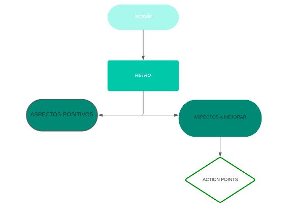

# CLASS 8

### Retro Flowchart

### My Action Points

Starting on 29/09/23:

- I'll take (at least) 3 hours a day focused on studyng and practicing.
- I'll participate more in slack, reacting to messages of the team and sharing doubts and content.
- I'll prepare the classes better by dividing the content into smaller sections in order to understand them better and work on them little by little.

### Imperative vs. Declarative Programming

Imperative programming refers to a programming paradigm where we provide the computer with step-by-step instructions on how to perform a particular task.
By contrast, declarative programming involves specifying what result we're expecting from our code. This is mainly achieved through special functions and tools that are provided by different frameworks and libraries of a programming language.

[More info](https://programiz.pro/resources/imperative-vs-declarative-programming/#:~:text=Imperative%20programming%20specifies%20and%20directs,about%20how%20the%20program%20works.)

### C Programming

C is a general-purpose, procedural, high-level programming language used in the development of computer software and applications, system programming, games, web development, and more. C language was developed by Dennis M. Ritchie at the Bell Telephone Laboratories in 1972. It is a powerful and flexible language which was first developed for the programming of the UNIX operating System. C is one of the most widely used programming language.

C programming language is known for its simplicity and efficiency. It is the best choice to start with programming as it gives you a foundational understanding of programming.

[More info](https://www.geeksforgeeks.org/c-programming-language/)

### Difference between Compiled and Interpreted Language

A compiled language is a programming language that is generally compiled and not interpreted. It is one where the program, once compiled, is expressed in the instructions of the target machine; this machine code is undecipherable by humans. Types of compiled language – C, C++, C#, CLEO, COBOL, etc. 

An interpreted language is a programming language that is generally interpreted, without compiling a program into machine instructions. It is one where the instructions are not directly executed by the target machine, but instead, read and executed by some other program. Interpreted language ranges – JavaScript, Perl, Python, BASIC, etc. 

[More info](https://www.geeksforgeeks.org/difference-between-compiled-and-interpreted-language/)

### ¿What’s the difference between using let and var in JavaScript??
The keywords **let** and **var** both declare new variables in JavaScript. The difference between **let** and **var** is in the scope of the variables they create:
- Variables declared by **let** are only available inside the block where they’re defined.
- Variables declared by **var** are available throughout the function in which they’re declared.

A **var** variable will be available thoroughout the function body in which it is defined, no matter how deeply nested its definition. A **let** variable will only be available within the same block where it is defined.
The behavior of **var** can be useful in some cases, but is quite different from other programming languages, and can cause difficult-to-resolve bugs. The more recently introduced **let** keyword allows for more precise and predictable variable scoping, and allows programmers to safely reuse names for temporary variables within the same function.
One final point to note is that when working outside of function bodies, at a global level, **let** does not create a property on the global object, whereas **var** does.
[More info](https://sentry.io/answers/difference-between-let-and-var-in-javascript/)

### Difference between " ", ' ' and ´´

[More info](https://developer.mozilla.org/en-US/docs/Learn/JavaScript/First_steps/Strings#Single_quotes_vs._double_quotes)

